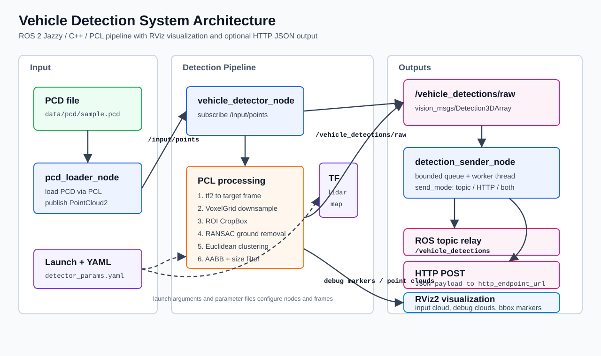

# Vehicle Detection System

ROS 2 Jazzy / C++ / PCL を使った、PCD 点群ベースの普通車検知システム。

## ドキュメント

- 要件定義書: [`docs/vehicle_detection_requirements.md`](docs/vehicle_detection_requirements.md)
- 基本設計書: [`docs/vehicle_detection_design.md`](docs/vehicle_detection_design.md)
- HTTP ペイロードスキーマ: [`docs/payload_schema.md`](docs/payload_schema.md)
- パイプライン実測値: [`docs/results.md`](docs/results.md)
- `ros2 topic echo` の実行例: [`docs/topic_echo.md`](docs/topic_echo.md)
- 既知の制約: [`docs/limitations.md`](docs/limitations.md)
- コーディング前チェックリスト: [`docs/pre_coding_checklist.md`](docs/pre_coding_checklist.md)

## アーキテクチャ



上図は、PCD 読み込みから PCL ベースの車両検知、RViz マーカー出力、ROS トピックリレー、任意の HTTP JSON 送信までの ROS 2 ノードフローをまとめたもの。設計の詳細は [`docs/vehicle_detection_design.md`](docs/vehicle_detection_design.md) を参照。

## ディレクトリ構成

```text
vehicle_detection_system/
  README.md
  ROADMAP.md
  CHANGELOG.md
  LICENSE
  Dockerfile                # 再現可能なビルドイメージ (osrf/ros:jazzy-desktop)
  data/pcd/                 # 実行時に配置する PCD ファイル (リポジトリには含めない)
  docs/                     # 要件・設計・結果・スキーマ・制約・図版
  src/vehicle_detection/    # ament_cmake ROS 2 パッケージ
    package.xml
    CMakeLists.txt
    include/vehicle_detection/
    src/
    launch/
    config/                 # detector_params.yaml, dataset_params.yaml, transforms.yaml, presets/
    rviz/                   # vehicle_detection.rviz
    test/
  tools/
    run_demo.sh             # ビルドと launch を 1 コマンドで実行
    receive_detections.py   # JSON ペイロード受信用のローカル HTTP レシーバ
```

## クイックスタート (Docker)

リファレンス環境は `osrf/ros:jazzy-desktop`。同梱の [`Dockerfile`](Dockerfile) は本リポジトリで必要な追加 ROS 2 パッケージ (`vision_msgs`、`tf2_sensor_msgs`、`colcon-common-extensions`) をインストールする。

```bash
# 1) イメージをビルド
docker build -t vehicle_detection:dev .

# 2) data/pcd/sample.pcd に PCD を配置 (data/pcd/README.md を参照)

# 3) パイプラインを起動 (1 コマンド)
docker run --rm -it \
  -v "$PWD":/workspace/vehicle_detection_system \
  -w /workspace/vehicle_detection_system \
  vehicle_detection:dev \
  ./tools/run_demo.sh data/pcd/sample.pcd
```

`run_demo.sh` は ROS 2 を source し、`colcon build --merge-install --packages-select vehicle_detection` を実行し、install スペースを source した上で `vehicle_detection.launch.py` を起動する。

## クイックスタート (ホスト側 ROS 2)

```bash
# ROS 2 Jazzy 環境上で、本リポジトリのルートから:
colcon build --merge-install --packages-select vehicle_detection
source install/setup.bash

ros2 launch vehicle_detection vehicle_detection.launch.py \
  pcd_file:=data/pcd/sample.pcd
```

挙動は launch 引数で上書きできる:

```bash
ros2 launch vehicle_detection vehicle_detection.launch.py \
  pcd_file:=/abs/path/to/cloud.pcd \
  input_frame_id:=lidar \
  target_frame_id:=map \
  publish_once:=true \
  use_sender:=true \
  use_rviz:=true \
  use_gui:=true
```

複数の PCD を `publish_rate_hz` の周期で順番に publish するには `pcd_directory` (Phase 2) を使う:

```bash
ros2 launch vehicle_detection vehicle_detection.launch.py \
  pcd_directory:=data/pandaset_lidar_pcd_subset/Lidar \
  pcd_glob:='*.pcd' \
  loop:=true
```

`pcd_directory` 配下の PCD は `pcd_glob` (既定 `*.pcd`) でフィルタし、ファイル名で sort された順に再生する。明示的なリストを使いたい場合は YAML から `pcd_files: ["a.pcd", "b.pcd"]` を渡す。`loop:=false` を指定するとリスト末尾で publish が停止 (ノードは生存)。`pcd_directory` も `pcd_files` も未指定の場合は MVP どおり単一 `pcd_file` のみを再生する。

検知パラメータの代表的な組み合わせを `detector_preset` (Phase 2、FR-014) で切り替えられる:

```bash
# PandaSet PCD デモに合わせて検証済みの値を使う
ros2 launch vehicle_detection vehicle_detection.launch.py \
  detector_preset:=pandaset_balanced

# 近距離 (約 20 m) に絞って軽量に確認
ros2 launch vehicle_detection vehicle_detection.launch.py \
  detector_preset:=near_range
```

`detector_preset` を省略、または `default` を指定したときは、`config/detector_params.yaml` の値がそのまま使われ、既存の挙動と一致する。プリセットは `src/vehicle_detection/config/presets/<name>.yaml` の読み取り専用 YAML として配置され、`vehicle_detector_node` の検知パラメータ (voxel / ROI / 地面除去 / clustering / 車両寸法フィルタ) のみを上書きする。HTTP 送信、検知結果保存、Web GUI、PCD 再生の挙動はプリセット切り替えで変わらない。

提供しているプリセット:

| 名前 | 用途 |
| --- | --- |
| `default` | 既存の `detector_params.yaml` をそのまま使う (no-op オーバーレイ) |
| `pandaset_balanced` | 同梱 PandaSet PCD デモ用に検証済みの検知パラメータ |
| `near_range` | 近距離 (約 20 m)・軽量な確認用に ROI と clustering を絞った設定 |

不明なプリセット名 (例: `detector_preset:=does_not_exist`) を指定した場合は、launch が起動失敗し、エラーメッセージに利用可能なプリセット一覧が表示される。プリセットは `params_file` のオーバーレイとして適用されるため、`params_file:=<custom>.yaml` と組み合わせると custom の値の上にプリセットが乗る。

PCD の代わりに rosbag を入力源として使うには `input_mode:=rosbag` (Phase 2、FR-015) を使う。`input_mode` を省略するか `pcd` を指定したときは既存挙動 (PCD 単一/連続再生) のまま:

```bash
# rosbag2 形式のディレクトリを再生 (bag 内のトピックがそのまま /input/points に流れる場合)
ros2 launch vehicle_detection vehicle_detection.launch.py \
  input_mode:=rosbag \
  rosbag_path:=/abs/path/to/bag

# bag 内の点群トピックを /input/points に remap
ros2 launch vehicle_detection vehicle_detection.launch.py \
  input_mode:=rosbag \
  rosbag_path:=/abs/path/to/bag \
  rosbag_topic:=/lidar/points

# ループ再生 + 倍速
ros2 launch vehicle_detection vehicle_detection.launch.py \
  input_mode:=rosbag \
  rosbag_path:=/abs/path/to/bag \
  rosbag_topic:=/lidar/points \
  rosbag_loop:=true \
  rosbag_rate:=2.0
```

`input_mode:=rosbag` のときは `pcd_loader_node` を起動せず、代わりに `ros2 bag play <rosbag_path> --rate <rosbag_rate> [--loop] [--remap <rosbag_topic>:=/input/points]` が `ExecuteProcess` として実行される。`rosbag_path` が未指定または存在しないパスを指している場合、launch は分かりやすいエラーで失敗する。`rosbag_topic` を空のままにすると remap せずに bag 内のトピックがそのまま流れる (bag 側で既に `/input/points` を使っている場合はこれで足りる)。rosbag の実データはリポジトリには含めず、各自で取得・配置する運用 (PCD と同じ)。

`use_sender:=true` を指定すると `detection_sender_node` が追加され、`/vehicle_detections` への再パブリッシュおよび／または [`docs/payload_schema.md`](docs/payload_schema.md) に沿った JSON の POST を行う。`use_rviz:=true` で `src/vehicle_detection/rviz/vehicle_detection.rviz` を読み込んだ RViz が起動する。`use_gui:=true` (既定) は実行時パラメータ調整用の `parameter_bridge_node` を起動する。詳細は [ブラウザ GUI](#ブラウザ-gui) を参照。

## パイプラインの確認

```bash
ros2 topic list
# /input/points  /vehicle_detections/raw  /vehicle_markers  ...

ros2 topic echo --once /vehicle_detections/raw
ros2 topic hz /vehicle_detections/raw
```

PandaSet サンプルを使った実行ログは [`docs/topic_echo.md`](docs/topic_echo.md) と [`docs/results.md`](docs/results.md) に記録している。

## RViz デモ

`use_rviz:=true` を指定すると、RViz は `Fixed Frame: map` の状態で `/input/points`、`/debug/points_filtered`、`/debug/clusters`、`/vehicle_markers` を購読する。記録済みの出力と件数は [`docs/results.md`](docs/results.md) にまとめている。


上のスクリーンショットは `./tools/run_demo.sh data/pcd/sample.pcd` を `use_rviz:=true` で実行したライブ実行から取得した。緑のマーカーは `/vehicle_markers` (普通車の AABB)、色付き点群は `/debug/points_filtered`。

## ブラウザ GUI

`parameter_bridge_node` は、実行時に ROS 2 パラメータを調整するための小さな Web UI を提供する。HTTP API は認証を持たないため、既定ではループバック (`127.0.0.1:8081`) にバインドし、同一マシンからのみ到達可能としている。

```bash
# 起動時に GUI を無効化する:
ros2 launch vehicle_detection vehicle_detection.launch.py use_gui:=false
```

Docker コンテナから Windows ホストへ GUI を公開する場合は、バインド先を `0.0.0.0` にしてポートを公開する:

```bash
# コンテナ内:
ros2 launch vehicle_detection vehicle_detection.launch.py gui_host:=0.0.0.0

# コンテナ起動時にポートを公開:
docker run -p 8081:8081 ...
```

`gui_port` と `host` は `detector_params.yaml`、または `ros2 param set /parameter_bridge_node host 0.0.0.0` でも設定できる。ループバック以外へのバインドは、実行時パラメータ書き込みを意図的に外部公開する操作として扱うこと。

ブリッジが公開する HTTP API:

| Method | Path              | Body / Response                                                |
| ------ | ----------------- | -------------------------------------------------------------- |
| GET    | `/`               | `parameter_gui.html`                                           |
| GET    | `/api/health`     | `{ ok, node, target_nodes }`                                   |
| GET    | `/api/parameters` | `{ ok, nodes: [{ name, available, parameters }] }`             |
| POST   | `/api/parameters` | `{ node, parameters: { ... } }` -> `{ ok, updated, rejected }` |

実装ライブラリ: [cpp-httplib](https://github.com/yhirose/cpp-httplib) (MIT。CMake はシステムの `httplib >= 0.27.0` が利用可能ならそれを使い、無い場合は upstream の `v0.28.0` を pin して取得する) と [nlohmann/json](https://github.com/nlohmann/json) (MIT、rosdep キーは `nlohmann-json-dev`)。

## テスト

```bash
colcon test --merge-install --packages-select vehicle_detection
colcon test-result --verbose --test-result-base build/vehicle_detection
```

最新のフル ROS 2 実行記録は **223 tests, 0 errors, 0 failures, 24 skipped** ([`docs/results.md`](docs/results.md) を参照)。実行環境は `osrf/ros:jazzy-desktop` ベースの Docker イメージ。

## 初期決定事項

- 初期データセット: PandaSet 由来の PCD サブセット
- 入力座標系: `lidar`
- 出力座標系: `map`
- `lidar -> map` 未指定時: identity transform
- 検知対象: 普通車のみ
- 検知情報送信: ROS 2 topic / HTTP POST / both / disabled を設定で切り替え
- GUI: Qt/rqt を使わないブラウザベース UI

## 既知の制約

詳細は [`docs/limitations.md`](docs/limitations.md) を参照 (単一フレームの幾何検知器、identity orientation、HTTP のみの送信、1 Hz / 150 ms per-frame の目標値など)。
