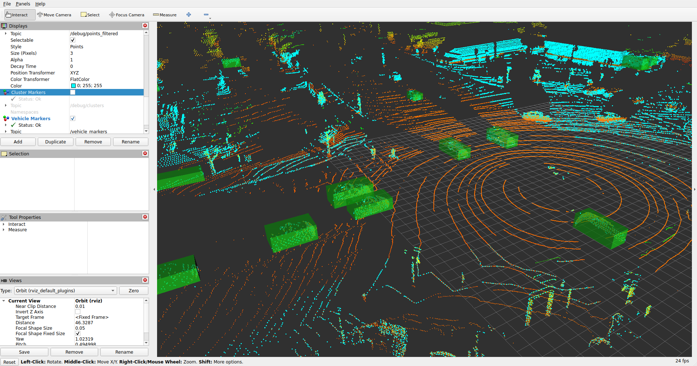

# 動作確認結果

本ドキュメントは、`osrf/ros:jazzy-desktop` Docker イメージ内で
`vehicle_detection.launch.py` のパイプラインをサンプル点群に対して
実行した際の実測値を記録したもの。

## 実行環境

- コンテナイメージ: `osrf/ros:jazzy-desktop`
- ROS 2 ディストリビューション: Jazzy
- コンパイラ: GCC (イメージのシステムデフォルト)
- PCL: ディストリ提供の `libpcl-all-dev`
- ワークスペースをコンテナにマウントし、`colcon build` の release 構成で
  ビルド

## パイプラインの数値

同梱の `detector_params.yaml` を用いた、代表的な単一フレーム実行の結果:

| ステージ                       | 点数 / 件数 |
|--------------------------------|-------------|
| 入力                           | 118,784     |
| voxel + ROI + 地面除去 後      | 9,627       |
| ユークリッドクラスタ           | 66          |
| 車両検知                       | 7           |
| フレーム当たり処理時間         | 約 160 ms   |

## サンプル検知

`/vehicle_detections/raw` に publish された
`vision_msgs/msg/Detection3DArray` から取り出した 1 件の検知:

- `bbox.center.position`: (20.29, -9.41, -0.95)
- `bbox.size`: (4.35, 2.54, 1.79) — bbox の identity orientation に整合する
  軸並行寸法 (`dx`、`dy`、`dz`)
- `results[0].hypothesis.class_id`: `car`
- `results[0].hypothesis.score`: 0.8 (プレースホルダの固定信頼度)

## テスト結果

`colcon test --merge-install --packages-select vehicle_detection` の
最新フル実行 (Jazzy + Docker) の結果は
**144 tests, 0 errors, 0 failures, 18 skipped**。実行されるテスト:

- `test_parameter_validation` — パラメータ検証ヘルパーに対する GTest
  単体テスト
- `test_point_cloud_processing` — PCL パイプラインヘルパー (bbox 寸法、
  車両フィルタ、AABB、CropBox、クラスタリング) に対する GTest 単体テスト
- `test_detection_json` — `Detection3DArray` の JSON シリアライズと
  HTTP URL パースに対する GTest 単体テスト
- `test_parameter_json` — `rclcpp::Parameter` と JSON の往復変換および
  ブラウザ GUI が拒否すべき不正値に対する GTest 単体テスト
- `test_launch_description` — `vehicle_detection.launch.py` が import
  でき、想定する launch 引数を宣言し、想定するノードを登録することを
  確認する pytest スモークテスト

## 確認済みトピック

`use_detector:=true` (既定) の場合:

- `/input/points` — `pcd_loader_node` からの `sensor_msgs/PointCloud2`
- `/vehicle_detections/raw` — `vision_msgs/Detection3DArray`
- `/debug/points_filtered` — voxel + ROI + 地面除去後の
  `sensor_msgs/PointCloud2`
- `/debug/clusters` — クラスタの AABB を表す
  `visualization_msgs/MarkerArray`
- `/vehicle_markers` — 普通車の AABB を表す
  `visualization_msgs/MarkerArray`

`use_sender:=true` の場合、`detection_sender_node` がフィルタ済みの検知を
`/vehicle_detections` に再 publish し (および設定済みの `http_endpoint_url`
へ JSON ペイロードを任意で POST する)。HTTP ペイロードのスキーマは
[`payload_schema.md`](payload_schema.md) に記載。

`use_rviz:=true` の場合、`rviz/vehicle_detection.rviz` を読み込んだ
RViz が起動する。これは `Fixed Frame: map` で上記すべてのトピックを
購読する。

上のスクリーンショットは、上記パイプラインの数値で参照したものと同じ
PandaSet サンプルに対し、`/debug/points_filtered` の上に
`/vehicle_markers` (緑の AABB) を重ねた様子を示す。

## 既知の制約

- 検知の姿勢は identity (軸並行)。yaw 推定は MVP のスコープ外。
- 信頼度は学習済み分類器が追加されるまで固定プレースホルダ。
- 地面除去は z 軸から約 15 度に制約された RANSAC 平面 1 枚で行うため、
  傾斜地や複数階層の地面では前処理が必要となる場合がある。
